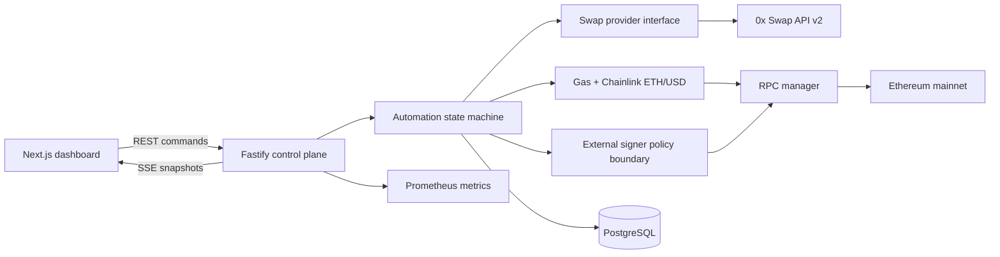
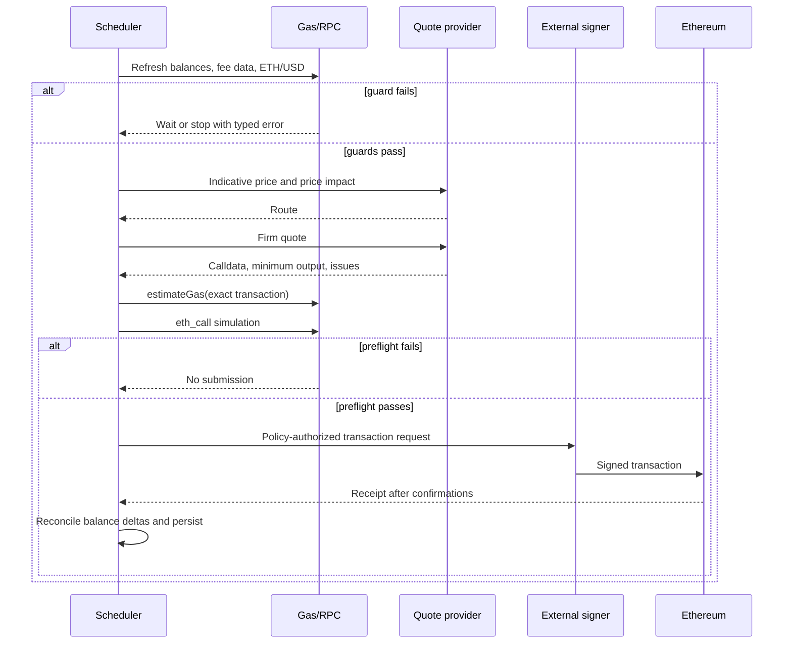

# System architecture

## Design goals

The design prioritizes prevention of unsafe submissions over cycle frequency. A trade is allowed only after wallet, balance, liquidity, price-impact, minimum-output, simulation, gas-cost, nonce, and signer-policy checks pass. A failed check changes state and records an explanation; it does not silently weaken a guard.

The default 10-second interval is technically possible but usually uneconomic on Ethereum mainnet. Interval is a scheduling preference, not permission to bypass confirmation or fee controls.

## Components



### Frontend

Next.js and React provide the control plane. TanStack Query handles request state, Zustand owns the latest live snapshot, Wagmi exposes injected, Coinbase, and WalletConnect-compatible connectors, and Framer Motion is limited to functional transitions. The application is responsive and honors reduced-motion preferences.

The browser receives only unsigned transaction requests. An extension or mobile wallet owns the key and produces signatures. WalletConnect requires `NEXT_PUBLIC_WALLETCONNECT_PROJECT_ID`.

### API

Fastify was selected over NestJS because this service has a small, explicit domain boundary and benefits from low overhead and schema-first handlers. Zod validates every mutable request. Helmet, strict CORS, rate limiting, body-size limits, request IDs, secret redaction, and normalized errors are enabled centrally.

### Automation state machine

States are `stopped`, `running`, `processing`, `waiting_for_gas`, `waiting_for_confirmation`, and `error`. Only one cycle can run per process. Updating `intervalSeconds` reschedules the next cycle immediately.

Stop conditions:

- Manual stop.
- Wallet value below the configured floor (required in a live signer adapter).
- Non-retryable preflight or execution error.
- Configured consecutive-failure limit.
- User policy limits such as daily notional (extension point).

Paper execution remains available for scheduler testing. Live execution uses externally owned wallets: the server prepares and independently preflights transaction data, while MetaMask, Coinbase Wallet, or WalletConnect displays and signs every approval and swap.

### RPC strategy

`RpcManager` keeps independent ethers v6 JSON-RPC providers, measures latency and block height, redacts credential-bearing paths, and selects a healthy provider after failure. Read operations retry across the configured list. A production signer must treat write submission differently: compute and sign once, then safely rebroadcast the identical raw transaction rather than creating transactions with new nonces.

For high-value reads, configure quorum reads using ethers `FallbackProvider`; ethers documents that it can require multiple backends to agree. Public endpoints are best-effort and rate-limited, so an authenticated Alchemy endpoint should be first in production.

### Gas protection

Fee cost is:

```text
estimated gas units × max fee per gas × Chainlink ETH/USD
```

For a real quote, the service must estimate the exact returned transaction. No transaction is submitted when the USD result exceeds the configured threshold. The next scheduled check resumes automatically. The Chainlink ETH/USD feed removes dependence on a centralized spot-price HTTP service.

### Swap routing decision

The first adapter targets 0x Swap API v2 AllowanceHolder:

- One integration aggregates AMM and professional market-maker liquidity.
- A firm quote returns executable calldata.
- The `issues` object surfaces balance, allowance, liquidity, and incomplete-simulation problems.
- The spender and transaction target come from each response and are never hardcoded.
- AllowanceHolder is the recommended simpler flow; approvals must never be granted to the Settler contract.

The provider interface leaves room for Uniswap Trading API, 1inch, Odos, or CoW Swap comparison. A production router should request concurrent indicative prices, normalize total cost (output, gas, fees, failure risk), select one route, then request a fresh firm quote. CoW intents can reduce MEV exposure but settlement timing is less compatible with strict alternating cycles. Uniswap is a strong direct fallback, while 1inch and Odos require separate credentials and operational review.

Primary references:

- [0x Swap API quick start](https://docs.0x.org/docs/introduction/quickstart/swap-tokens-with-0x-swap-api)
- [0x v2 issues and error handling](https://docs.0x.org/docs/introduction/api-issues)
- [0x v2 security and allowance guidance](https://docs.0x.org/docs/upgrading/upgrading-to-swap-v2)
- [Uniswap Trading API integration](https://developers.uniswap.org/docs/trading/swapping-api/integration-guide)
- [Uniswap routing concepts](https://developers.uniswap.org/docs/trading/swapping-api/concepts/swap-routing)
- [ethers v6 FallbackProvider](https://docs.ethers.org/v6/api/providers/fallback-provider/)
- [Flashbots documentation](https://docs.flashbots.net/)
- [ZIG token on Ethereum](https://etherscan.io/token/0xb2617246d0c6c0087f18703d576831899ca94f01)

## Swap lifecycle



The sell leg uses the confirmed ZIG balance delta from the buy receipt, not the quote's optimistic output. This prevents a failed/partial buy from causing an invalid sell.

## Persistence

The migration defines settings, cycles, trades, gas history, typed errors, RPC health, and audit logs. Amounts use exact base-unit numeric columns. Transaction hash is unique for idempotent receipt reconciliation. Production workers should write within transactions and use a distributed lock keyed by wallet address.

## Scaling

- API instances remain stateless control planes.
- The in-process scheduler represents one due cycle and never starts a second cycle while one is active.
- The current deployment runs one API automation engine and persists recovery state in PostgreSQL.
- Do not run multiple API replicas for the same wallet until a PostgreSQL advisory lock is implemented.
- Separate read and write RPC pools prevent health checks from starving submissions.
- Partition trade, gas, and RPC tables by time when volume warrants it.
- Use an outbox table for durable notification delivery.
